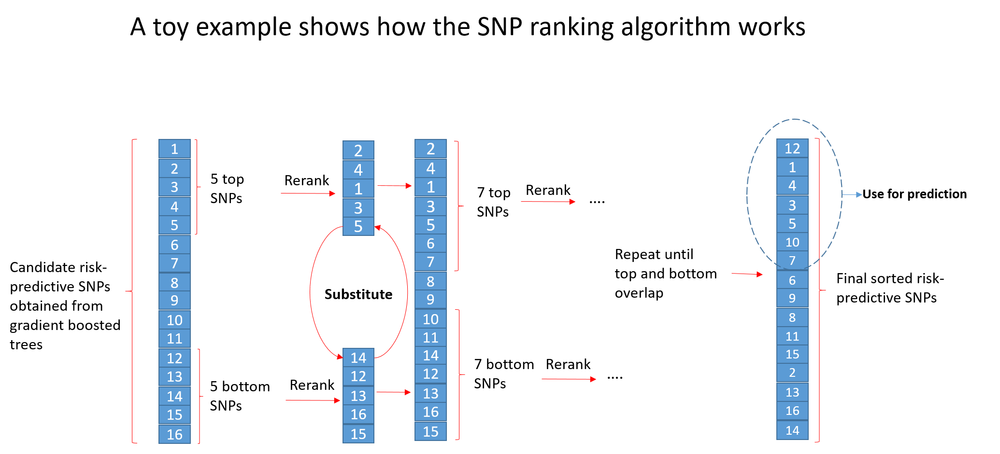

# Breast cancer risk prediction using genotyped data

This repository provides the implementation source codes used in the manuscript entitled **[Machine learning identifies interacting genetic variants contributing to breast cancer risk: A case study in Finnish cases and controls](https://www.nature.com/articles/s41598-018-31573-5)** to present results and discussion. Due sensitivity of sample sets, implementation source codes in this repository use a randomly generated data with the same size and elements as the original sample sets. 

## Python requirements
**Libraries**  **version**

Python            2.7.12

xgboost           0.6a2

scipy             0.18.1

numpy             1.11.2

matplotlib        2.1.1

pandas            0.19.2

sklearn           0.18.2

## Steps in running the source codes
**1)** XGBoost optimization using training subset: 

**xgboost_optimization_0.py**:  Gird search over n_estimators = [50, 100], max_depth = [2, 4, 6, 8] and learning_rate = [0.001, 0.01, 0.1].

**xgboost_optimization_1.py**: Gird search over n_estimators = [150, 200], max_depth = [2, 4, 6, 8] and learning_rate = [0.001, 0.01, 0.1].

**xgboost_optimization_2.py**: Gird search over n_estimators = [250, 300], max_depth = [2, 4, 6, 8] and learning_rate = [0.001, 0.01, 0.1].

**xgboost_optimization_7.py**: Gird search over subsample = [0.1, 0.2, 0.3, 0.4, 0.5, 0.6, 0.7, 0.8, 0.9, 1] after finding the optimal n_estimators, max_depth and learning_rate.

**2)** **second_module.py** : Runs adaptive iterative search over the candidate SNPs found by the XGBoost model on the validation subset to find the best combination of SNPs with high breast cancer risk prediction potential at each iteration (Algorithm 1 in the manuscript)

**3)** **report_results.py**: Computes mean average precisions on the test, validation and training subsets using the interacting SNPs found by the second module.
